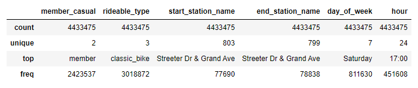
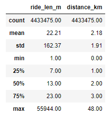
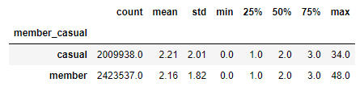
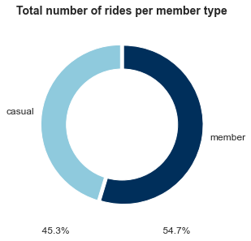
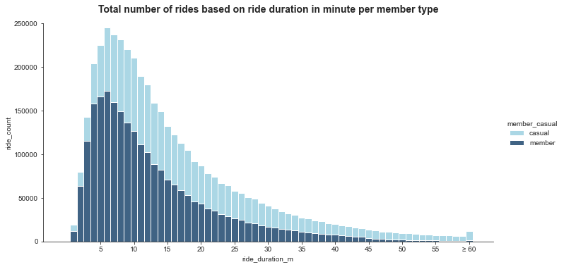
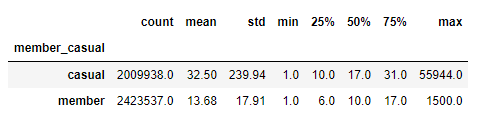
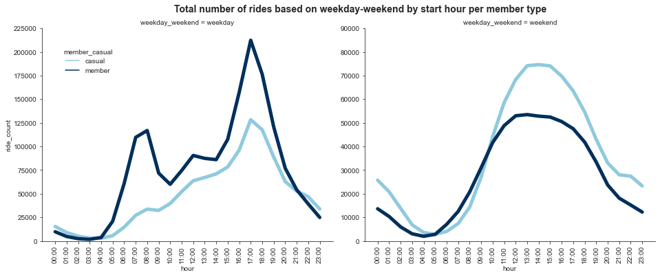

**[linkedin.com/in/fransiskusadrian](https://id.linkedin.com/in/fransiskusadrian)**
 
  Hello, my name is Fransiskus Adrian. Welcome to my portfolio website :)
  
 **MY PROJECTS**
 
 5 November 2021
 
 Google Data Analytics Professional Certificate Capstone Project

# Case Study: How Does a Bike-Share Navigate Speedy Success?

#### Scenario
You are a junior data analyst working in the marketing analyst team at Cyclistic, a fictional bike-share company in Chicago.

#### About the Company
In 2016, Cyclistic launched a successful bike-share offering. Since then, the program has grown to a fleet of 5,824 bicycles that are geotracked and locked into a network of 692 stations across Chicago. The bikes can be unlocked from one station and returned to any other station in the system anytime.

#### Problem
Until now, Cyclistic’s marketing strategy relied on building general awareness and appealing to broad consumer segments. One approach that helped make these things possible was the flexibility of its pricing plans: single-ride passes, full-day passes, and annual memberships. Customers who purchase single-ride or full-day passes are referred to as casual riders. Customers who purchase annual memberships are Cyclistic members.

Cyclistic’s finance analysts have concluded that annual members are much more profitable than casual riders. Although the pricing flexibility helps Cyclistic attract more customers, The director of marketing believes that maximizing the number of annual members will be key to future growth. Rather than creating a marketing campaign that targets all-new customers, The director of marketing believes there is a very good chance to convert casual riders into members. She notes that casual riders are already aware of the Cyclistic and have chosen Cyclistic for their mobility needs.

The director of marketing has set a clear goal: Design marketing strategies aimed at converting casual riders into annual members. In order to do that, however, the marketing analyst team needs to better understand how annual members and casual riders differ. The director of marketing and her team are interested in analyzing the Cyclistic historical bike trip data to identify trends.

#### Task
The director of marketing has assigned you to answer: How do annual members and casual riders use Cyclistic bikes differently?

#### Data
Previous 12 months of Cyclistic trip data. The data consisted of 12 files containing more than 5 million records of ride histories from November 2020 to October 2021. The fields consist of ride id, ride start time, ride end time, ride start station name, ride start station id, ride end station name, ride end station id, ride start latitude, ride start longitude, ride end latitude, ride end longitude, type of bike and customer type.

#### Analysis Process
I combine all the data into one single file. Then, I cleaned up all the data and add some new columns for later analysis. Some of the cleaning process that I do was to remove unnecessary columns, remove missing values, trim all cells that have excess spaces, remove duplicates, make all data type consistent and remove bad data. The data has been processed to remove trips that are taken by staff as they service and inspect the system; and any trips that were below 60 seconds in length (potentially false starts or users trying to re-dock a bike to ensure it was secure). So, at the end I have 4,433,475 records and 19 fields. _(Full Analysis Process)_

#### Descriptive Analysis
Statistical data of non-numeric data:

Statistical data of numeric data:

Statistical data of trip distance in km per customer type:

From the statistical data we can conclude that there are outliers that might skew the result, thus to count the average we will use the median instead of the mean because the median is less sensitive to outliers. _(Full Analysis Process)_

#### Findings
From 4,433,475 number of rides in the past 12 months, 54.7% of it was made by Cyclistic members and 45.3% of it was made by casual riders.

The chart below shows that the most commom trip duration is six minutes long and how Cyclistic members dominated the short trip duration while casual riders dominated the long trip duration.

On average the trip duration for Cyclistic members is 10 minutes long and casual riders is 17 minutes long, which means casual riders use Cyclistic bike longer even almost twice longer than the annual members usually use Cyclistic bike.

For all users, the peak trip start time is around 5 p.m. and the through start time is around 3 a.m. to 4 a.m. 

The chart below shows that the Cyclistic members most often used Cyclistic bike before and after the regular working hours, around 8 a.m., 12 a.m. and 5 p.m., which indicating that Cyclistic members may use Cyclistic bike for commuting to and from work.

