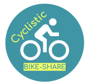

**[linkedin.com/in/fransiskusadrian](https://id.linkedin.com/in/fransiskusadrian)**
 
  Hello, my name is Fransiskus Adrian. Welcome to my portfolio website :)
 
 
 **ABOUT ME**
 
 As a data analyst, I translate data into a valuable and comprehensible insights. I am experienced in collecting, transforming, and organizing data for analysis to help make informed decisions. I have excellent understanding and proficiency of platforms for effective data analyses, including SQL, spreadsheets, Tableau, Power BI, R and Python.
 
 
 **MY PROJECTS**
 
# Case Study: How Does a Bike-Share Navigate Speedy Success?
5 November 2021, _Google Data Analytics Professional Certificate Capstone Project_
 
 
 
#### Scenario
You are a junior data analyst working in the marketing analyst team at Cyclistic, a fictional bike-share company in Chicago.

#### About the Company
In 2016, Cyclistic launched a successful bike-share offering. Since then, the program has grown to a fleet of more than 5,000 bicycles that are geotracked and locked into a network of more than 600 stations across Chicago. The bikes can be unlocked from one station and returned to any other station in the system anytime. Cyclistic has the flexibility of its pricing plans: single-ride passes, full-day passes, and annual memberships. Customers who purchase single-ride or full-day passes are referred to as casual riders. Customers who purchase annual memberships are Cyclistic members.

#### Problem
Cyclistic’s finance analysts have concluded that annual members are much more profitable than casual riders. Although the pricing flexibility helps Cyclistic attract more customers, The director of marketing believes that maximizing the number of annual members will be key to future growth. Rather than creating a marketing campaign that targets all-new customers, The director of marketing believes there is a very good chance to convert casual riders into members. She notes that casual riders are already aware of the Cyclistic and have chosen Cyclistic for their mobility needs.

The director of marketing has set a clear goal: Design marketing strategies aimed at converting casual riders into annual members. In order to do that, however, the marketing analyst team needs to better understand how annual members and casual riders differ. The director of marketing and her team are interested in analyzing the Cyclistic historical bike trip data to identify trends.

#### Task
The director of marketing has assigned you to answer: How do annual members and casual riders use Cyclistic bikes differently?

#### Data
Previous 12 months of Cyclistic trip data. The data consisted of 12 files containing more than 5 million records of ride histories from November 2020 to October 2021. The fields consist of ride id, ride start time, ride end time, ride start station name, ride start station id, ride end station name, ride end station id, ride start latitude, ride start longitude, ride end latitude, ride end longitude, type of bike and customer type.

#### Analysis Process
I combine all the data into one single file. Then, I cleaned up all the data and add some new columns for later analysis. Some of the cleaning process that I do was to remove unnecessary columns, remove missing values, trim all cells that have excess spaces, remove duplicates, make all data type consistent and remove bad data. The data has been processed to remove trips that are taken by staff as they service and inspect the system; and any trips that were below 60 seconds in length (potentially false starts or users trying to re-dock a bike to ensure it was secure). So, at the end I have 4,433,475 records and 19 fields. [_( Full Analysis Process )_](https://github.com/fransiskusadrian/fransiskusadrian.github.io/blob/main/docs/assets/documents/cyclistic-bike-share_ver-github.ipynb)

#### Descriptive Analysis
Statistical data of non-numeric data:

Statistical data of numeric data:

From the statistical data we can conclude that there are outliers that might skew the result, thus to count the average we will use the median instead of the mean because the median is less sensitive to outliers. [_( Full Analysis Process )_](https://github.com/fransiskusadrian/fransiskusadrian.github.io/blob/main/docs/assets/documents/cyclistic-bike-share_ver-github.ipynb)

#### Findings
From 4,433,475 number of rides in the past 12 months, 54.7% of it was made by Cyclistic members and 45.3% of it was made by casual riders.

The chart below shows that the most commom trip duration is six minutes long and how Cyclistic members dominated the short trip duration while casual riders dominated the long trip duration.

On average the trip duration for Cyclistic members is 10 minutes long and casual riders is 17 minutes long, which means casual riders use Cyclistic bike longer even almost twice longer than the annual members usually use Cyclistic bike.

Additionally, the figure below displays the average duration per day by each user type, which shows the average duration of the ride is consistently higher among casual riders in comparison with Cyclistic members throughout the week.

For all users, the peak trip start time is around 5 p.m. and the through start time is around 3 a.m. to 4 a.m.

The chart below shows that the Cyclistic members most often used Cyclistic bike before and after the regular working hours, around 8 a.m., 12 a.m. and 5 p.m., which indicating that Cyclistic members may use Cyclistic bike for commuting to and from work.

Additionally, the figure below displays the frequency of trips per day by each user type which shows Cyclistic bike is most often used on Saturday and casual riders more likely to take rides on weekends than weekdays.

In the past 12 months, Cyclistic bike is most often used in July and least often used in February.

The figure shows an upward trend during warmer months and a downward trend during colder months, there were fewer rides in November, and then fewer still in December, January and February. On an average ride duration, casual riders ride longer than Cyclistic members throughout the year.

The chart below shows that the most commom trip distance is 1 km and how Cyclistic members and casual riders domination in each trip distance.

On average, for all users the average trip distance is 2 km.

The chart below shows the top 10 start station most used by all users and how its users domination in each station. This shows that the most frequently used station as start station is Streeter Dr & Grand Ave station.

The chart below shows the top 10 end station most used by all users and how its users domination in each station. This shows that the most frequently used station as end station is also Streeter Dr & Grand Ave station.

The most favorite bike used by all users is classic bike.

#### Conclusion
In the past 12 months, annual members use Cyclistic bike more often than casual riders use Cyclistic bike. On average, casual riders ride Cyclistic bike longer even almost twice longer than the Cyclistic members ride Cyclistic bike. The average trip distance of all users using Cyclistic bike is 2 km. The most favorite bike type used by all users is classic bike. Cyclistic bike is most often used on Saturday. Cyclistic members more likely to ride Cyclistic bike on weekdays while casual riders on weekends. In weekdays, the peak demand for bikes among Cyclistic members are between 7 a.m. until 8 a.m. and 5 p.m. until 6 p.m., while the peak demand for bikes among casual riders are between 5 p.m. until 6 p.m. In weekends, the peak demand for bikes among Cyclistic members and casual riders are between 12 p.m. until 3 p.m. The most used station is Streeter Dr & Grand Ave station, where it is dominated by casual riders. Both Cyclistic members and casual riders use Cyclistic bike more often on warmer months and not so often on colder months.

#### Tools
Python and Jupyter Notebook 

#### End of Project
For full analysis process in Jupyter Notebook, please go [here](https://github.com/fransiskusadrian/fransiskusadrian.github.io/blob/main/docs/assets/documents/cyclistic-bike-share_ver-github.ipynb).

#### Author
[Fransiskus Adrian](https://id.linkedin.com/in/fransiskusadrian)
