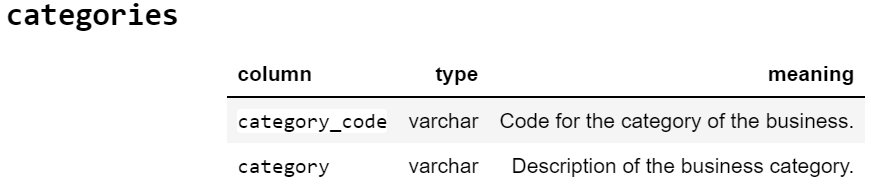
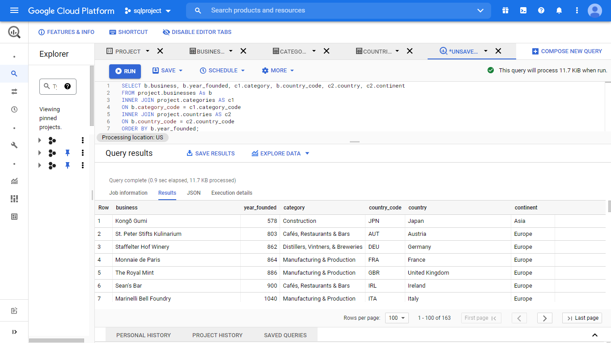
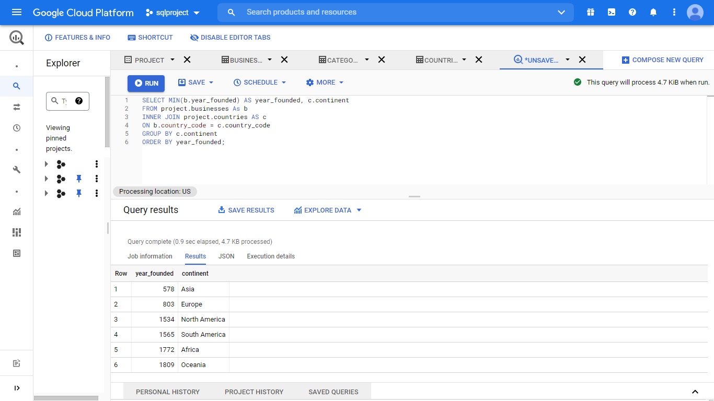

# SQL Project: What and Where Are the World's Oldest Businesses?
2 December 2021, _DataCamp SQL Project_
 

An important part of business is planning for the future and ensuring that the company survives changing market conditions. Some businesses do this really well and last for hundreds of years.

BusinessFinancing.co.uk researched the oldest company that is still in business in (almost) every country and compiled the results into a dataset. In this project, you'll explore that dataset to see what they found.

The database contains three tables.
 
 

 
 

 
 

 
 
  Let's begin by looking at the range of the founding years of businesses throughout the world:
 
  
 
  The results shows that in one country, the oldest business was only founded in 1999. By contrast, the oldest business in the world was founded back in 578. That's pretty incredible that a business has survived for more than a millennium.
 
  I wonder how many other businesses there are like that, that have been around for more than a millennium:
 
  
 
  Now we know, there are 6 other businesses that have been around for more than a millennium. We also know that the oldest, continuously operating company in the world is called Kongō Gumi. But was does that company do?
 
  
 
  With that extra detail about the oldest businesses, we can see that Kongō Gumi is a construction company. In that list of six businesses, we also see a restaurant, a winery, and a bar. The two companies recorded as "Manufacturing and Production" are both mints. What is a mint? A mint is a primary producer of a country's coin currency.

I'm curious as to what other industries constitute the oldest companies around the world, and which industries are most common:
 
  
 
  It looks like "Banking & Finance" is the most popular category. Maybe that's where you should aim if you want to start a thousand-year business.
 
  One thing we haven't looked at yet is where in the world these really old businesses are:
 
  
  
  How old the oldest business is on each continent?
 
  
 
  How many old business is on each continent?
 
  
 
  Which are the most common categories for the old businesses on each continent?
  
  
 
#### Conclusion
The oldest business in the world was founded back in 578. The oldest company in the world which still operates until now is a construction company called Kongō Gumi located in Japan. The most common industry between the oldest companies around the world is "Banking & Finance" industry. Most of the oldest companies around the world was founded in Africa.

#### Tools
Google BigQuery

#### End of Project
